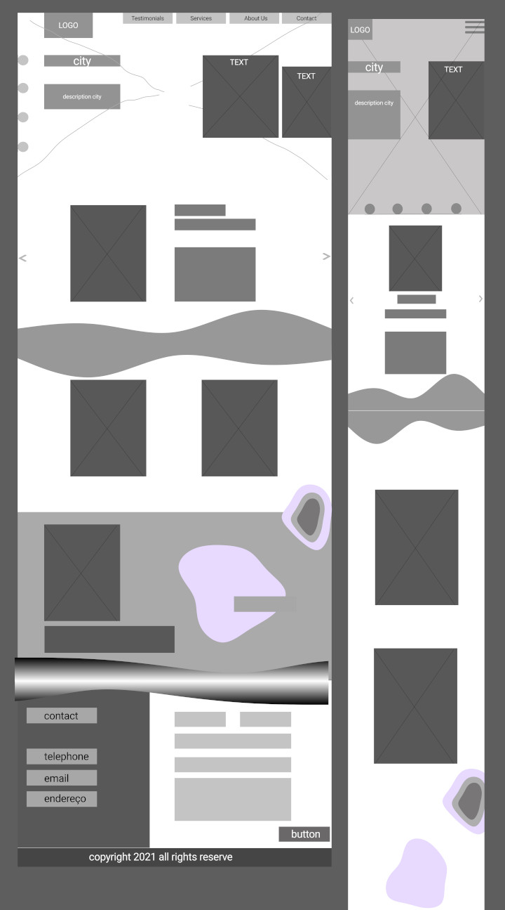
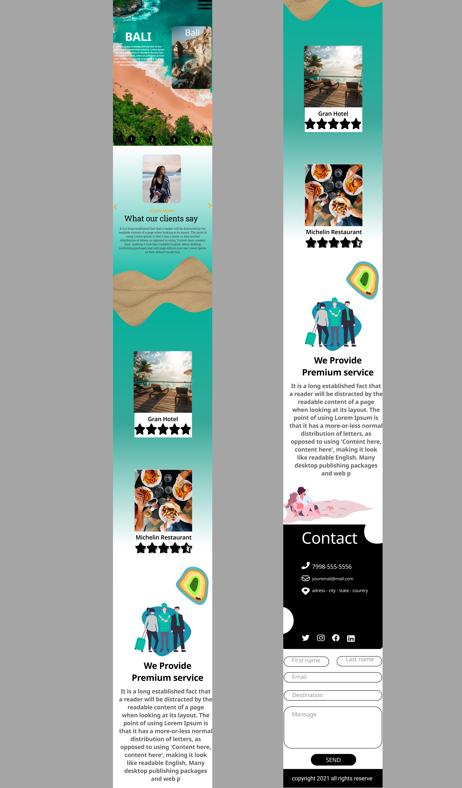

<!---
RodrigoSilva5/RodrigoSilva5 is a ✨ special ✨ repository because its `README.md` (this file) appears on your GitHub profile.
You can click the Preview link to take a look at your changes.
--->

 <h1> Hi, I'm Rodrigo</h1>

 

<h3>💻 Front-end Developer | 🌏 Brazil </h3>

### About Me

- 👋 I’m self-taught, programming student and technology lover
- 👀 I’m interested in programming in general, but at the moment I'm focusing on web development.
- 💞️ I’m looking to collaborate on anything I can help and improve my skills
- 📫 How to reach me <code></code> <code></code>

### Frequently Used Languages and Tools 

<code></code>  
<code></code>
<code></code>
<code></code>
<code>  </code>
<code></code>
<code></code>
<code></code>
<code></code>
<code></code>
<code></code>
<code></code>
<code></code>
<code></code> 

 

  <h3 width="30px"><strong>A LITTLE OF MY WORK </strong></h3>
  <code></code>  
  <h4><a href="https://github.com/RodrigoSilva5/Travel-Agency-Landing-Page">You can check the code here</a></h4> 
  <h4>MOCKUP </h4> 
  <h5>WIREFRAME</h5>
  <code></code>  
  <h5>FINAL PRODUCT</h5>
  <code></code>  
  <code></code>   
<h4>Programming 

</h4>
  <h4>Final Product</h4>
  <h5>MOBILE</h5>
  <code></code>  
  <h5>DESKTOP</h5>
  <code></code>
  <h5>TABLETS</h5>
  <code></code>  

